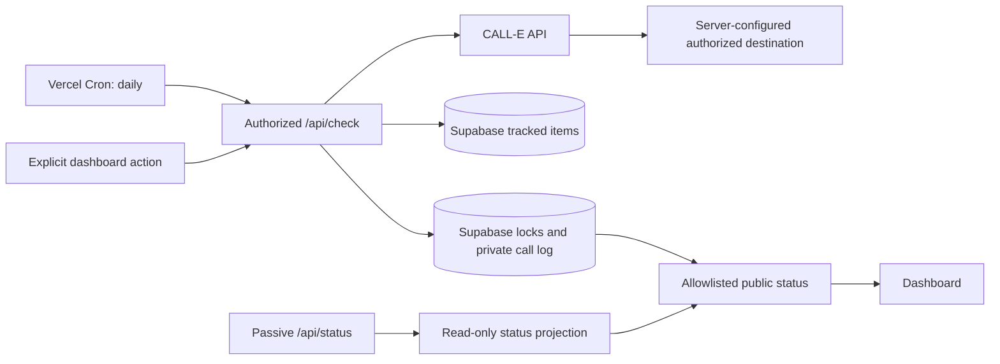

# Cooldown Caller

Cooldown Caller tracks recurring actions with cooldown windows and can place a reminder call through CALL-E when a scheduled or explicitly requested check discovers that an item is actionable.

[Live app](https://cooldown-caller.vercel.app) · [CALL-E examples PR #239](https://github.com/CALLE-AI/awesome-phone-call-agents/pull/239) · MIT License

## Exact behavior

Cooldown Caller is discovery-based, not continuous:

- Vercel Cron calls `/api/check` once daily at `13:00 UTC`.
- The dashboard can request the same check manually.
- A call is considered only when one of those checks runs.
- If a cooldown clears between checks, no call is placed at that instant. The next authorized check discovers it.
- A passive dashboard refresh calls `/api/status`; it never claims a call slot or places a call.
- Marking an item done restarts its cooldown clock.

The system therefore promises scheduled and manual evaluation, not real-time monitoring or immediate delivery.

## Safety model

Every outbound call uses one server-configured, pre-authorized destination. No request, tracked item, database row, or browser control can choose or override that destination.

Before placing a call, the server:

1. Loads tracked items from Supabase.
2. Computes cooldown state using deterministic timestamp arithmetic.
3. Fails closed if the call log cannot be read.
4. Skips items that are still cooling down or were already called in the current cycle.
5. Claims a cycle-specific lock.
6. Sends a cycle-specific idempotency key to CALL-E.
7. Persists the provider response for private operational use.

Cooldown values below one hour are rejected by application validation and the database constraint.

## Privacy by construction

Provider payloads are private server-side records. Public endpoints return an allowlisted status projection only:

- tracked item identifier and display name;
- operational status and completion flag;
- creation/update timestamps;
- scheduled or manual trigger label.

Public API responses and the dashboard do not expose destination values, provider call or recipient identifiers, prompts, summaries, transcripts, or transcript-derived fingerprints. The demo endpoint returns only whether placement was accepted and the current operational status.

The repository contains no callable phone fixture. `.env.example` uses a symbolic deployment placeholder. Tests use symbolic non-dialable destinations. The public contact below uses the reserved `example.com` domain.

## Architecture



## Data model

Tracked items contain only scheduling information: `id`, `name`, `category`, `cooldown_hours`, `last_action_at`, and `source`.

There is intentionally no destination field. The SQL setup is documented in `docs/supabase/001_tracked_items.sql`; RLS is enabled on the table.

## Local development

```bash
npm install
npm run dev
```

Copy `.env.example` to `.env.local` and configure secrets locally. Never commit real credentials or destination values.

Required server variables: `CALLE_API_KEY`, `CALLE_BASE_URL`, `TARGET_PHONE`, `SUPABASE_URL`, `SUPABASE_ANON_KEY`, `APP_ORIGIN`, `CRON_SECRET`, and `MANUAL_TRIGGER_TOKEN`.

## Verification

```bash
npm test
npm run build
```

The test suite mocks CALL-E and Supabase. Tests must never place an outbound call or access a live database.

## Scope and limitations

- The daily cron creates up to one-day discovery latency.
- The current Supabase lock uses a best-effort read/write sequence rather than an atomic compare-and-set operation. CALL-E idempotency provides a second duplicate-call defense.
- This demo uses a single authorized destination and is not a multi-tenant calling service.
- Tracked examples model recurring workflows; they are not synchronized with third-party publishing or marketplace APIs.

## Contact

Privacy and security review: `contact@example.com`

## License

MIT
