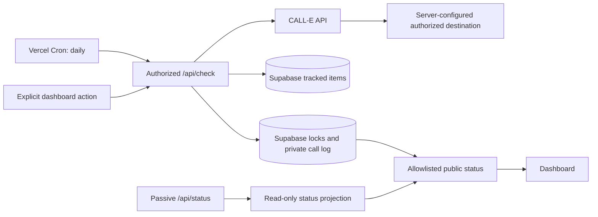

<div align="center">

# Cooldown Caller

### Discovery-Based, Not Continuous. One Authorized Destination. Nothing Sensitive Leaves the Server.

Cooldown Caller tracks recurring actions with cooldown windows and places a reminder call through CALL-E when a scheduled or explicitly requested check discovers that an item is actionable. Every outbound call targets one server-configured, pre-authorized destination — no request, tracked item, database row, or browser control can ever choose or override it.

<p>
  <a href="https://cooldown-caller.vercel.app"></a>
  <a href="https://github.com/jayblast-spec/cooldown-caller"></a>
  <a href="https://github.com/CALLE-AI/awesome-phone-call-agents/pull/239"></a>
</p>

<p>
  
  
  
  
  
  
  
  <a href="LICENSE"></a>
</p>

<p>
  
</p>

</div>

---

## What It Does

Cooldown Caller watches a set of tracked items, each with a cooldown period and a last-action timestamp, and calls a single pre-authorized phone number through CALL-E to remind you the moment one clears. It is deliberately **discovery-based, not continuous**: a call only happens when something actually runs the check.

- Vercel Cron calls `/api/check` once daily at `13:00 UTC`.
- The dashboard's "Run check now" button can request the same check manually.
- A passive dashboard refresh calls the read-only `/api/status` instead — it never claims a call slot or places a call.
- If a cooldown clears between checks, no call is placed at that instant; the next authorized check discovers it.
- Marking an item done restarts its cooldown clock.

## How It Works



Before placing a call, `app/api/check/route.ts` runs a fail-closed sequence: it loads tracked items from Supabase, computes cooldown state with deterministic timestamp arithmetic (`lib/cooldown.ts`), refuses to proceed if the call log can't be read, skips anything still cooling down or already called in the current cycle, claims a cycle-specific Supabase lock, sends a cycle-specific idempotency key to CALL-E, and persists the provider response as a private, server-only record. Cooldown values below one hour are rejected by both application validation and a database constraint.

**Privacy by construction.** Provider payloads never leave the server. `lib/call-log-store.ts`'s `redactLogForClient` is the only function allowed to shape a public response, and it allowlists exactly: tracked-item id and display name, operational status, completion flag, timestamps, and trigger label. Public endpoints and the dashboard never expose the destination, CALL-E's provider call/recipient identifiers, prompts, summaries, transcripts, or transcript-derived fingerprints — `/api/demo-call` returns only whether placement was accepted and the current status. The repository contains no callable phone fixture: `.env.example` uses a symbolic placeholder, and tests use symbolic non-dialable destinations.

**Auth boundary.** `/api/check` accepts only Vercel Cron's own trigger header or a bearer token matching `CRON_SECRET` — every other request gets `401 Unauthorized cron trigger.`, confirmed against the live deployment.

## Data Model

Tracked items store only scheduling information: `id`, `name`, `category`, `cooldown_hours`, `last_action_at`, and `source` — there is intentionally no destination field anywhere in the CRUD path. The SQL setup lives in `docs/supabase/`, and Row Level Security is enabled on every table.

## Live

**[cooldown-caller.vercel.app](https://cooldown-caller.vercel.app)** — the dashboard loads real computed cooldown state immediately. Try marking an item done, or hitting "Run check now" to trigger a live, authorized evaluation cycle.

## Tech Stack

| Layer | Technology |
|---|---|
| Frontend | Next.js 16 (App Router), React 19, TypeScript, Tailwind v4 |
| Data | Supabase (tracked items, cycle locks, private call log) — RLS enabled |
| Scheduling | Vercel Cron (`vercel.json`, daily `/api/check`) |
| Calling provider | CALL-E API |
| Testing | Vitest (54 tests: cooldown math, call-log redaction, route auth) |
| Hosting | Vercel |

<details>
<summary><strong>Running locally</strong> (click to expand)</summary>

```bash
npm install
cp .env.example .env.local
npm run dev
```

Required server variables: `CALLE_API_KEY`, `CALLE_BASE_URL`, `TARGET_PHONE`, `SUPABASE_URL`, `SUPABASE_ANON_KEY`, `APP_ORIGIN`, `CRON_SECRET`, and `MANUAL_TRIGGER_TOKEN`. Never commit real credentials or destination values.

```bash
npm test
npm run build
```

The test suite mocks CALL-E and Supabase — tests never place an outbound call or touch a live database.

</details>

<details>
<summary><strong>Scope and limitations</strong> (click to expand)</summary>

- The daily cron creates up to one-day discovery latency.
- The current Supabase lock uses a best-effort read/write sequence rather than an atomic compare-and-set operation. CALL-E idempotency provides a second duplicate-call defense.
- This demo uses a single authorized destination and is not a multi-tenant calling service.
- Tracked examples model recurring workflows; they are not synchronized with third-party publishing or marketplace APIs.

</details>

## 🧠 The Agent Pattern — Extend This

Cooldown Caller is a reference implementation of a discovery-based agent. Use it as a template for:

- **Event-driven alerts** — not dashboards
- **Fail-closed security** — verify everything
- **Single-channel output** — one call, not fifty notifications

### Build Your Own Variation

1. **Swap the input:** watch a database, an API, or a calendar instead of a cooldown.
2. **Swap the output:** send an SMS, a webhook, or a Slack message instead of a call.
3. **Swap the brain:** add an LLM step to qualify *why* the alert matters before it goes out.

### Example Prompts to Give Claude/Cursor

- *"Turn this agent into a compliance deadline tracker for SEC filings."*
- *"Extend it to watch Ethereum gas fees and call when they drop below 20 gwei."*
- *"Add a reasoning step that summarizes the opportunity before placing the call."*

The pattern — watch, verify, alert, fail closed — stays the same. None of the above is built yet; it's a starting point for a fork, not a claim about this repo's current scope.

## Lessons From Getting This Wrong Once

Early builds of this repo committed real operational data during development: a real destination number, real CALL-E identifiers, and real call transcripts under `docs/evidence/`. External review caught it, not an internal check, which is its own lesson.

The fix that actually held wasn't a find-and-replace pass. It was three separate things:

- **Structural, not habitual, redaction.** `lib/call-log-store.ts`'s `redactLogForClient` allowlists exactly which fields cross the public boundary. Every other field on a log entry, including ones added later, is private by default because the function has to name a field to expose it, not the reverse.
- **Fail closed on missing config, not fail open on a convenient default.** `TARGET_PHONE` used to fall back to a hardcoded value if the environment variable was unset. That's the kind of thing that looks harmless in a local `.env` and becomes a real leak the moment it ships. `app/api/check/route.ts` now skips all call evaluation for the cycle if the variable isn't set, rather than guessing.
- **Rewriting history isn't the same as removing exposure.** A force-pushed clean branch stops the bad commit from being reachable, but the commit itself is still individually resolvable on GitHub until the platform's own cache is cleared. That's a second, separate step, not a formality.

The actual rule this produced: a fixture or a fallback should be structurally incapable of holding real data, not just conventionally expected to hold fake data. `"REDACTED_DESTINATION"` as a literal test string can't leak a phone number by accident. A realistic-looking placeholder can.

<div align="center">


</div>
